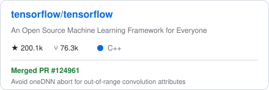
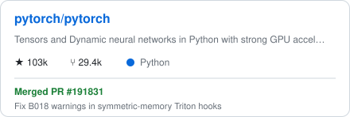
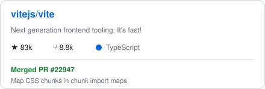
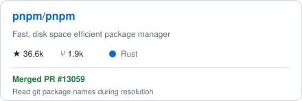
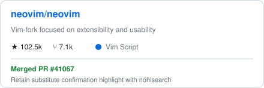
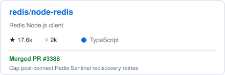
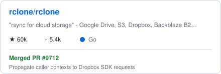
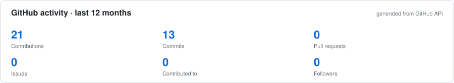
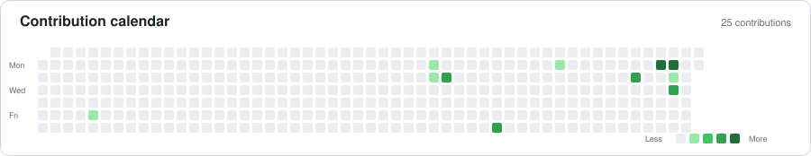

# Debaditya Hait

**AI systems · distributed systems · open source**

[GitHub](https://github.com/DebadityaHait) · [LinkedIn](https://linkedin.com/in/debadityahait) · [Email](mailto:debaditya2005hait@gmail.com)

## About

I'm a Computer Science Engineering student at **SRMIST**, also pursuing a **BS in Data Science and Applications at IIT Madras**.

Most of my work is around systems and applied ML: distributed storage, backend infrastructure, edge AI, LLM safety, scientific machine learning, and developer tooling.

Previously:

- **Samsung R&D Institute India** — PRISM Research Intern
- **IIT Madras** — AI Research & Prototyping Intern

I also contribute upstream across Rust, C/C++, Python, TypeScript/JavaScript, and Go.

---

## Open source

**56 upstream pull requests, 17 merged** across projects including TensorFlow, PyTorch, pnpm, Vite, Neovim, Redis, rclone, PostHog, Cloudflare Workers SDK, MUI, Docling, Apache DataFusion, and others.

The cards below are generated from the GitHub API once per day and committed into this repository. They do not depend on a public README-widget service at page-load time.

<table>
<tr>
<td width="50%">
<a href="https://github.com/tensorflow/tensorflow/pull/124961">
<picture>
  <source media="(prefers-color-scheme: dark)" srcset="./assets/widgets/repo-tensorflow-dark.svg">
  
</picture>
</a>
</td>
<td width="50%">
<a href="https://github.com/pytorch/pytorch/pull/191831">
<picture>
  <source media="(prefers-color-scheme: dark)" srcset="./assets/widgets/repo-pytorch-dark.svg">
  
</picture>
</a>
</td>
</tr>
<tr>
<td width="50%">
<a href="https://github.com/vitejs/vite/pull/22947">
<picture>
  <source media="(prefers-color-scheme: dark)" srcset="./assets/widgets/repo-vite-dark.svg">
  
</picture>
</a>
</td>
<td width="50%">
<a href="https://github.com/pnpm/pnpm/pull/13059">
<picture>
  <source media="(prefers-color-scheme: dark)" srcset="./assets/widgets/repo-pnpm-dark.svg">
  
</picture>
</a>
</td>
</tr>
<tr>
<td width="50%">
<a href="https://github.com/neovim/neovim/pull/41067">
<picture>
  <source media="(prefers-color-scheme: dark)" srcset="./assets/widgets/repo-neovim-dark.svg">
  
</picture>
</a>
</td>
<td width="50%">
<a href="https://github.com/redis/node-redis/pull/3388">
<picture>
  <source media="(prefers-color-scheme: dark)" srcset="./assets/widgets/repo-redis-dark.svg">
  
</picture>
</a>
</td>
</tr>
<tr>
<td width="50%">
<a href="https://github.com/rclone/rclone/pull/9712">
<picture>
  <source media="(prefers-color-scheme: dark)" srcset="./assets/widgets/repo-rclone-dark.svg">
  
</picture>
</a>
</td>
<td width="50%">
<a href="https://github.com/PostHog/posthog/pull/70314">
<picture>
  <source media="(prefers-color-scheme: dark)" srcset="./assets/widgets/repo-posthog-dark.svg">
  
</picture>
</a>
</td>
</tr>
</table>

### Selected changes

| Project | Contribution |
|---|---|
| **TensorFlow** | Prevented out-of-range oneDNN convolution attributes from aborting the process; preserved 64-bit values and returned `InvalidArgumentError`. [PR #124961](https://github.com/tensorflow/tensorflow/pull/124961) |
| **pnpm** | Added resolve-time Git manifest handling in the Rust-native resolver, including option-injection and path-traversal hardening. [PR #13059](https://github.com/pnpm/pnpm/pull/13059) |
| **Vite** | Fixed CSS chunk mapping under experimental import maps to avoid stale styles after CSS-only deployments. [PR #22947](https://github.com/vitejs/vite/pull/22947) |
| **Neovim** | Fixed transient substitution-confirmation highlights in UI2 when `nohlsearch` is enabled. [PR #41067](https://github.com/neovim/neovim/pull/41067) |
| **Node Redis** | Bounded Sentinel topology rediscovery and prevented commands from hanging during complete Sentinel outages. [PR #3388](https://github.com/redis/node-redis/pull/3388) |
| **PyTorch** | Fixed B018 warnings in distributed symmetric-memory Triton hooks while preserving lazy attribute lookup behavior. [PR #191831](https://github.com/pytorch/pytorch/pull/191831) |
| **rclone** | Propagated caller contexts through Dropbox SDK requests for prompt cancellation and cleanup. [PR #9712](https://github.com/rclone/rclone/pull/9712) |
| **PostHog** | Added configurable concurrency to the Rust CLI sourcemap uploader. [PR #70314](https://github.com/PostHog/posthog/pull/70314) |

More upstream work

 

Apache DataFusion Comet · Apache DataFusion Ballista · AWS Lambda Powertools · Twenty · CERN TIGRE · MUI · IBM Docling · Cloudflare Workers SDK · Deepset Haystack · Delta Lake `delta-rs` · Hugging Face Safetensors · Deno · Electron · AWS Lambda Rust Runtime · Apple CoreMLTools · Astral `uv` · Ansible · Kubernetes · Next.js · Storybook · Nx · Pytest · OpenTelemetry · Ray · MuJoCo · Sentry CLI · nvm

---

## Selected projects

### [Stratum](https://github.com/DebadityaHait/stratum)

S3-compatible object storage built on Cloudflare Workers, D1, R2, and Telegram.

- D1-backed metadata layer
- R2 warm cache and Cloudflare Cache for hot reads
- Telegram Bot API as cold object storage
- multipart upload state, presigned URLs, tags, and lifecycle rules
- SHA-256 and Content-MD5 integrity checks
- S3-compatible XML responses

**Measured:** 95% estimated storage-cost reduction, sub-50 ms metadata queries, and 60% lower TTFB for frequently accessed objects.

[Live deployment](https://stratum.opener.workers.dev)

### [ShopLense](https://github.com/DebadityaHait/ShopLense)

Quick-commerce price comparison and stock tracking across Zepto, Blinkit, Flipkart Minutes, and Swiggy Instamart.

- reverse-engineered marketplace web traffic without public APIs
- concurrent vendor searches
- normalized product grouping
- price and stock alerts
- scheduled background checks
- geolocation and pincode-aware inventory

**Measured:** 99.8% extraction success, sub-2-second multi-vendor search latency, and 10,000+ SKUs grouped.

### [WoundDoc](https://github.com/DebadityaHait/WoundDoc)

Mobile wound-assessment system combining classification, segmentation, calibrated area measurement, tissue analysis, and longitudinal monitoring.

Stack includes React Native, EfficientNet-B0, SegFormer, TensorFlow Lite, and Python-based inference services.

**Results:** 92.33% classification accuracy, 92.99% Dice on binary wound segmentation, and 4.7% mean area-estimation error in manual cross-checks.

### [Outlinr](https://github.com/DebadityaHait/outlinr)

Multilingual PDF structure extraction using PyMuPDF, layout features, rule-based logic, and Random Forest classification.

**Results:** 93.8% heading-hierarchy accuracy across 412 multilingual PDFs with 100% output success.

More projects

 

**OnyxBin** — self-hosted cloud storage with Postgres metadata and Telegram-backed binary storage, adaptive chunking, SHA-256 verification, HMAC-signed Next.js → FastAPI requests, streamed downloads, and recursive folder operations.

**Pulseflare** — Cloudflare-native uptime monitoring and incident intelligence built with Workers, D1, KV, Queues, R2, Workers AI, React, and Vite.

**PomoTogether** — collaborative Pomodoro app using React Native and Firebase with synchronized timers, shared sessions, and real-time chat.

---

## Research

### Samsung R&D Institute India

Worked on an encoder-only AI safety classifier based on **ModernBERT-large (395M parameters)** for prompt-injection and jailbreak detection.

- trained on 75,000+ augmented prompts
- 92.70% accuracy
- 0.9021 F1
- 35 ms inference latency
- approximately 300× faster than generation-based alternatives in the benchmark setup

### IIT Madras

Developed Physics-Informed Neural Networks for Alzheimer's disease progression modeling using longitudinal MRI data and biological differential equations embedded in the training loss.

The approach improved early neurodegeneration prediction accuracy by **27%** over the conventional deep-learning baseline used in the project.

### Publications / manuscripts

- **AI Guardrails: Performance-Optimized Guardrail System for Secure LLM and Agentic AI Interactions** — accepted to ICSCCC 2026
- **WoundDoc: A Mobile AI-Assisted Wound Assessment System for Segmentation, Type Detection, and Longitudinal Healing Monitoring** — MIDL 2026 submission record

---

## Stack

**Languages:** Rust · C/C++ · Python · Go · TypeScript · JavaScript · Java · SQL

**Backend / systems:** FastAPI · Node.js · REST APIs · SQLAlchemy · distributed storage · object storage · S3-compatible APIs · HMAC signing · chunked I/O

**ML:** PyTorch · TensorFlow · TensorFlow Lite · Hugging Face · scikit-learn · computer vision · PINNs · quantization · on-device inference

**Infrastructure:** PostgreSQL · Cloudflare Workers · D1 · R2 · KV · Queues · Docker · Kubernetes · Azure · GCP · Vercel · GitHub Actions

---

## Competitive programming

| Platform | Standing |
|---|---|
| Codeforces | Expert, peak Candidate Master |
| LeetCode | Guardian, top 2% |
| CodeChef | 4★ |

---

## Selected distinctions

- Goldman Sachs India Hackathon 2026, Quant Track — **AIR 42 / ~14,000**
- Goldman Sachs India Hackathon 2026, CS Track — **AIR 144 / 15,953**
- Amazon ML Summer School 2026 — selected among **3,000 of 134,000+ applicants**
- Flipkart GRiD 8.0 — National Semifinalist
- Flipkart GRiD 7.0 — National Semifinalist
- Adobe India Hackathon 2025 — Semifinalist
- Founder's Scholarship, SRMIST

---

## Certifications

**Microsoft — 9 certifications:** Azure AI Engineer · Azure Data Scientist · Azure Developer · Fabric Data Engineer · Fabric Analytics Engineer · Power BI Data Analyst · Azure AI Fundamentals · Azure Data Fundamentals · Azure Fundamentals

Also:

- Claude Certified Architect — Foundations, Anthropic
- Oracle Cloud Infrastructure AI Foundations Associate
- Machine Learning Specialization — DeepLearning.AI / Stanford University

---

## GitHub activity

<picture>
  <source media="(prefers-color-scheme: dark)" srcset="./assets/widgets/github-stats-dark.svg">
  
</picture>

 

<picture>
  <source media="(prefers-color-scheme: dark)" srcset="./assets/widgets/contribution-calendar-dark.svg">
  
</picture>

<!-- Optional: contribution snake generated by .github/workflows/snake.yml

<picture>
  <source media="(prefers-color-scheme: dark)" srcset="https://raw.githubusercontent.com/DebadityaHait/DebadityaHait/output/github-contribution-grid-snake-dark.svg">
  
</picture>

-->

---

## Contact

[LinkedIn](https://linkedin.com/in/debadityahait) · [GitHub](https://github.com/DebadityaHait) · [Email](mailto:debaditya2005hait@gmail.com)
